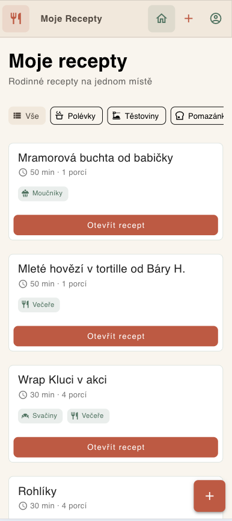
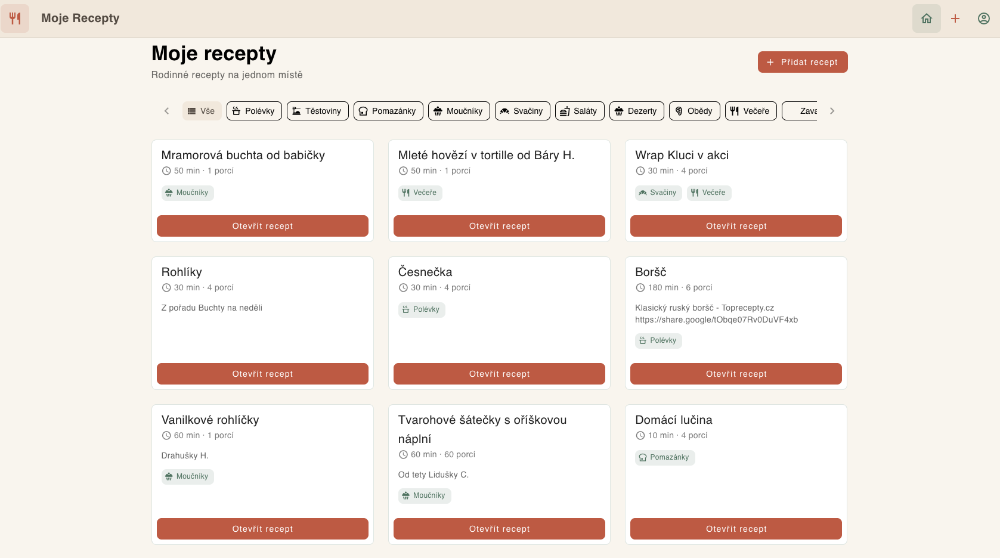
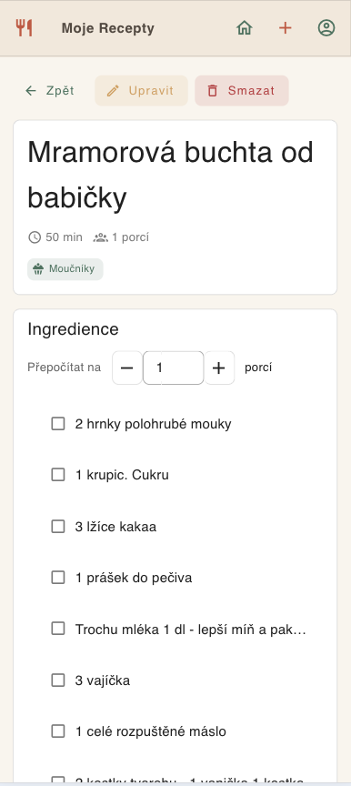
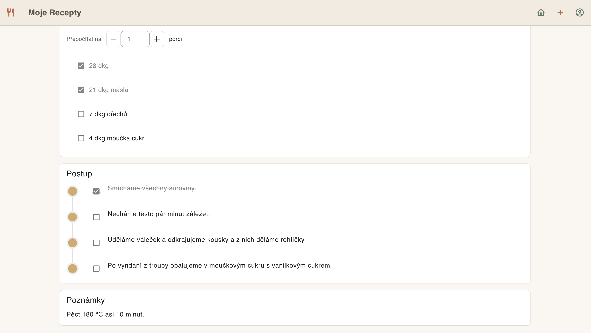
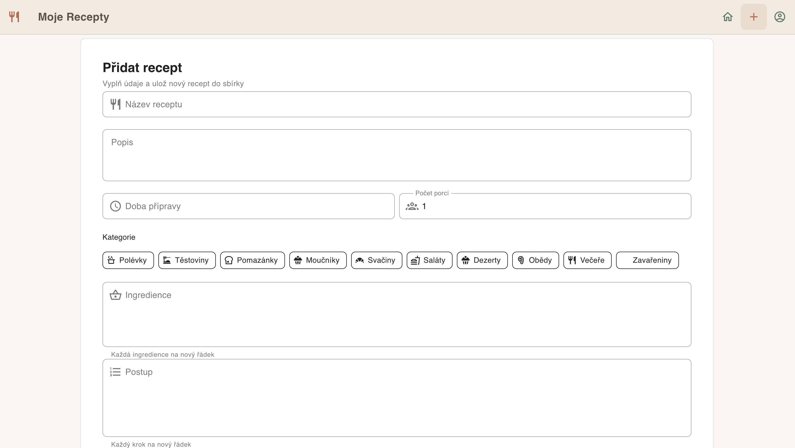
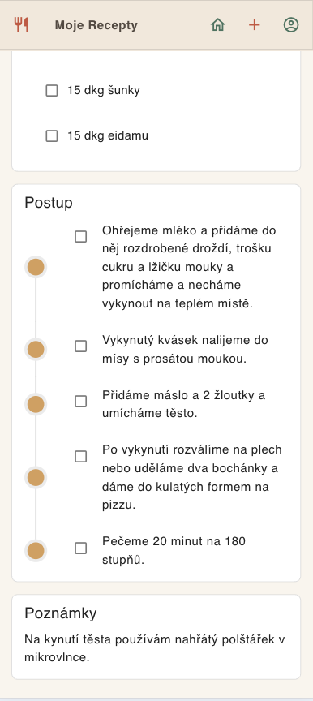

# MojeRecepty

Soukromá webová aplikace pro ukládání rodinných receptů. Frontend je postavený jako SPA ve Vue 3 a data i přihlášení obsluhuje Supabase.

## Aktuální stack

- `Vue 3`
- `Vite`
- `Vue Router`
- `Pinia`
- `Vuetify 3`
- `Supabase`

## Struktura projektu

Samotná aplikace je ve složce `app/`.

- `app/src/main.js` – vstupní bod aplikace
- `app/src/router/index.js` – trasy a auth guard
- `app/src/stores/auth.js` – přihlášení uživatele
- `app/src/stores/recipes.js` – načítání a správa receptů
- `app/src/views/` – jednotlivé obrazovky aplikace
- `app/src/lib/supabase.js` – inicializace Supabase klienta

V kořeni repozitáře je pouze pomocný `package.json`. Vývojové skripty jsou definované v `app/package.json`.

## Funkce

- seznam receptů s filtrováním podle kategorií
- detail receptu s přepočtem porcí
- přidání nového receptu
- úprava a smazání receptu
- přihlášení přes e-mail a heslo
- synchronizace dat přes Supabase

## Náhled aplikace

### Domovská stránka





### Detail receptu





### Přidání receptu



### Postup vaření



## Lokální spuštění

Pozor: `npm run dev` v kořeni projektu nefunguje, protože `dev` script je definovaný jen ve složce `app`.

### Varianta 1

```bash
cd app
npm install
npm run dev
```

### Varianta 2

```bash
npm --prefix app install
npm --prefix app run dev
```

Po spuštění bude aplikace dostupná typicky na `http://localhost:5173`. Pokud je port obsazený, Vite použije jiný, například `5174`.

## Build

```bash
npm --prefix app run build
```

Výstup se generuje do `app/dist`.

## Environment proměnné

Frontend očekává tyto proměnné v `app/.env`:

```bash
VITE_SUPABASE_URL=...
VITE_SUPABASE_ANON_KEY=...
```

Používej pouze anonymní klíč určený pro frontend. Service role key do klienta nepatří.

## Datový model

Aplikace pracuje s tabulkou `recipes` v Supabase. V kódu se používají zejména tato pole:

- `id`
- `user_id`
- `title`
- `description`
- `categories`
- `minutes`
- `servings`
- `ingredients`
- `steps`
- `notes`
- `created_at`

## Bezpečnost

Bezpečnost dat stojí na autentizaci v Supabase a na správně nastavených RLS policy pro tabulku `recipes`.

Doporučení:

- povol `SELECT`, `INSERT`, `UPDATE` a `DELETE` jen přihlášenému uživateli nad jeho vlastními záznamy
- váž data přes `user_id = auth.uid()`
- neukládej žádné tajné serverové klíče do `VITE_*` proměnných

Příklad logiky pro RLS:

```sql
create policy "Users can read own recipes"
on public.recipes
for select
to authenticated
using (auth.uid() = user_id);

create policy "Users can insert own recipes"
on public.recipes
for insert
to authenticated
with check (auth.uid() = user_id);

create policy "Users can update own recipes"
on public.recipes
for update
to authenticated
using (auth.uid() = user_id)
with check (auth.uid() = user_id);

create policy "Users can delete own recipes"
on public.recipes
for delete
to authenticated
using (auth.uid() = user_id);
```

## Stav projektu

Projekt je nasazený a běžící. Dokumentace v tomto souboru odpovídá aktuálnímu kódu v repozitáři, zejména aplikaci ve složce `app/`.
